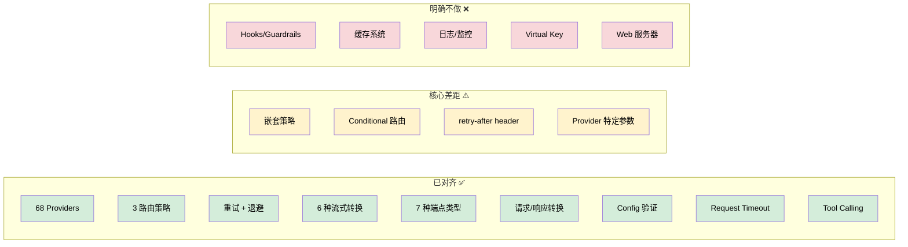

# Chainr vs Portkey 差异报告

**生成时间**: 2026-04-24 19:07 EEST（Phase 3C 完成后更新）

**Portkey 版本**: portkey-ai-gateway (本地 clone)
**Chainr 版本**: Phase 3C Complete, 205 tests, main branch

---

## 1. 架构差异（根本性）

| 维度 | Portkey | Chainr | 评估 |
|------|---------|--------|------|
| 运行形态 | Hono Web 服务器（独立网关） | 嵌入式 SDK（npm 包） | ✅ 设计如此 |
| 请求入口 | HTTP 路由 + 中间件管道 | `chainr.chat.completions.create()` 方法调用 | ✅ 设计如此 |
| 配置传递 | `x-portkey-config` header + 请求体 | 构造函数 `ChainrConfig` | ✅ 设计如此 |
| 依赖 | Hono, async-retry, 多个中间件 | 仅 @smithy/signature-v4 + @aws-crypto/sha256-js | ✅ 设计如此 |
| 部署目标 | Node.js / Cloudflare Workers / Lagon | Node.js ≥ 18（Firebase 友好） | ✅ 设计如此 |

> 以上差异是 Chainr 的核心定位决定的，不需要对齐。

---

## 2. Provider 数量对比

| 指标 | Portkey | Chainr | 差异 |
|------|---------|--------|------|
| 总 provider 数 | 75 | 68 | -7 |
| 注册表完整性 | 75/75 | 68/68 | ✅ 各自完整 |

### Portkey 有但 Chainr 缺失的 Provider（7 个）

| Provider | 类型 | 优先级 |
|----------|------|--------|
| `qdrant` | 向量数据库 | 🔴 低（非 LLM） |
| `milvus` | 向量数据库 | 🔴 低（非 LLM） |
| `nscale` | 推理平台 | 🟡 中 |
| `portkey` | 自引用 | 🔴 不需要 |
| `snowflake` | 数据平台 | 🟡 中 |
| `cortex` | 本地推理 | 🟡 中 |
| 其他新增 | — | 需逐一核实 |

> 向量数据库（qdrant/milvus）和 portkey 自引用不在 Chainr 范围内。

---

## 3. 路由策略差异（核心功能）

| 策略 | Portkey | Chainr | 状态 |
|------|---------|--------|------|
| `single` | ✅ | ✅ | ✅ 已对齐 |
| `fallback` | ✅ | ✅ | ✅ 已对齐 |
| `loadbalance` | ✅ | ✅ | ✅ 已对齐 |
| `conditional` | ✅ MongoDB 风格查询路由 | ❌ | ⚠️ 缺失 |
| 嵌套策略 | ✅ 完全递归 | ✅ 完全递归 + 配置继承 | ✅ 已对齐 |
| 熔断器 (Circuit Breaker) | ⚠️ 钩子扩展点 | ❌ | 🟡 低优先级 |

### 3.1 `conditional` 策略详情（Portkey 独有）

Portkey 的 conditional 路由支持 MongoDB 风格查询：
- 操作符：`$eq`, `$ne`, `$gt`, `$gte`, `$lt`, `$lte`, `$in`, `$nin`, `$regex`, `$and`, `$or`
- 上下文键：`metadata.*`, `params.*`, `url.pathname`
- 每个 condition 有 `query` + `then`（目标名称），按顺序匹配，有 `default` 兜底

### 3.2 嵌套策略详情

Portkey 的 `tryTargetsRecursively()` 支持完全递归：
- fallback 的某个 target 可以是一个 loadbalance 组
- 配置（retry, cache, overrideParams, hooks, timeout）沿树继承，子级覆盖父级

---

## 4. 重试逻辑差异

| 特性 | Portkey | Chainr | 状态 |
|------|---------|--------|------|
| 指数退避 | ✅ via async-retry | ✅ 自实现 | ✅ 已对齐 |
| 默认重试码 | [429,500,502,503,504] | [429,500,502,503,504] | ✅ 一致 |
| 非重试码快速失败 | ✅ bail() | ✅ 400/401/404 | ✅ 已对齐 |
| `retry-after` header 支持 | ✅ 读取 retry-after-ms / x-ms-retry-after-ms / retry-after | ✅ 同 Portkey 优先级 + 60s 预算 | ✅ 已对齐 |
| 最大重试等待 60s 上限 | ✅ MAX_RETRY_LIMIT_MS | ✅ 60s cap | ✅ 已对齐 |
| fetchWithTimeout | ✅ AbortController | ✅ AbortController | ✅ 已对齐 |
| ConnectTimeoutError → 503 | ✅ | ❌ 未区分 | 🟡 小差异 |

---

## 5. 流式处理差异

| 特性 | Portkey | Chainr | 状态 |
|------|---------|--------|------|
| SSE 文本流解析 | ✅ | ✅ | ✅ 已对齐 |
| AWS EventStream 二进制帧解析 | ✅ readAWSStream() | ✅ transformBedrockStream | ✅ 已对齐 |
| Provider 分隔符映射 | ✅ | ✅ | ✅ 已对齐 |
| 首 chunk 延迟 (25ms) | ✅ | ✅ | ✅ 已对齐 |
| Azure 1ms chunk 间隔 | ✅ isSleepTimeRequired | ❌ | 🟡 小差异 |
| JSON → SSE 转换（缓存命中） | ✅ | ❌ | ❌ 无缓存所以不需要 |
| Hook 结果注入流 | ✅ | ❌ | ❌ 无 Hook 所以不需要 |
| 流式重试 | ✅ retryRequestForStream | ✅ retryRequestForStream | ✅ 已对齐 |

---

## 6. 请求/响应转换差异

| 特性 | Portkey | Chainr | 状态 |
|------|---------|--------|------|
| ProviderConfig 参数映射 | ✅ | ✅ | ✅ 已对齐 |
| min/max/default 钳位 | ✅ | ✅ | ✅ 已对齐 |
| transform 函数 | ✅ | ✅ | ✅ 已对齐 |
| 点号嵌套路径 (setNestedProperty) | ✅ | ✅ | ✅ 已对齐 |
| responseTransforms | ✅ | ✅ | ✅ 已对齐 |
| FormData 转换 | ✅ transformToFormData() | ❌ 未确认 | ⚠️ 需核实 |
| 文件上传 (uploadFile) | ✅ ReadableStream 转换 | ❌ | ❌ 缺失 |
| proxy 模式（原样透传） | ✅ | ❌ | 🟡 低优先级 |

---

## 7. 端点覆盖差异

| 端点类型 | Portkey | Chainr | 状态 |
|----------|---------|--------|------|
| chatComplete | ✅ | ✅ | ✅ |
| complete (legacy) | ✅ | ❌ | 🟡 低优先级 |
| embed | ✅ | ✅ | ✅ |
| imageGenerate | ✅ | ✅ | ✅ |
| imageEdit | ✅ | ❌ | 🟡 |
| createSpeech | ✅ | ✅ | ✅ |
| createTranscription | ✅ | ✅ | ✅ |
| createTranslation | ✅ | ✅ | ✅ |
| rerank | ✅ | ❌ | 🟡 |
| moderate | ✅ | ❌ | 🔴 低 |
| realtime (WebSocket) | ✅ | ❌ | 🟡 |
| uploadFile / listFiles / deleteFile | ✅ | ❌ | 🟡 |
| createBatch / retrieveBatch | ✅ | ❌ | 🟡 |
| createFinetune / listFinetunes | ✅ | ❌ | 🟡 |
| messages (Anthropic native) | ✅ | ❌ | ⚠️ 中优先级 |
| messagesCountTokens | ✅ | ❌ | 🟡 |
| createModelResponse (OpenAI Responses API) | ✅ | ❌ | ⚠️ 中优先级 |

---

## 8. Portkey 独有功能（Chainr 明确不做的）

| 功能 | 说明 | Chainr 态度 |
|------|------|-------------|
| Hooks / Guardrails 系统 | beforeRequest/afterRequest 钩子，GUARDRAIL + MUTATOR | ❌ 不做 |
| 20+ 内置 Guardrail 插件 | PII、内容审核、JSON Schema 校验等 | ❌ 不做 |
| 第三方 Guardrail 集成 | Aporia, Azure, Bedrock, Patronus 等 | ❌ 不做 |
| 缓存系统 | 内存/Redis/Cloudflare KV/文件缓存 | ❌ 不做 |
| 日志中间件 | 请求/响应日志记录 | ❌ 不做 |
| Virtual Key 管理 | API Key 抽象 + 预算控制 | ❌ 不做 |
| 请求验证中间件 | 入站请求格式校验 | ❌ 不做 |
| WebSocket Realtime | OpenAI Realtime API 代理 | ❌ 暂不做 |
| 压缩中间件 | 响应压缩 | ❌ 不需要（SDK） |

---

## 9. 需要对齐的高优先级差异

### ~~🔴 P0 — 必须实现~~ ✅ 已完成

| # | 差异项 | 说明 | 状态 |
|---|--------|------|------|
| 1 | **嵌套策略** | fallback 内嵌 loadbalance，配置递归继承 | ✅ Phase 3B |
| 2 | **retry-after header** | 读取 provider 返回的 retry-after 头，60s 预算机制 | ✅ Phase 3B |

### 🟡 P1 — 应该实现

| # | 差异项 | 说明 | 工作量 |
|---|--------|------|--------|
| 3 | **conditional 路由** | MongoDB 风格条件路由（按 metadata/params 分发） | 中 |
| 4 | **Anthropic Messages API 原生端点** | 直接暴露 `/messages` 而非仅 chat completions 转换 | 中 |
| 5 | **OpenAI Responses API** | `createModelResponse` — OpenAI 新 API 格式 | 中 |
| 6 | ~~**Tool/Function Calling 完整对齐**~~ | ~~各 provider 的 tool 参数转换~~ | ✅ Phase 3C |
| 7 | **Provider-specific params 完整对齐** | Anthropic beta、Bedrock guardrail 等（已在 TODO 中） | 大 |

### 🟢 P2 — 可选实现

| # | 差异项 | 说明 | 工作量 |
|---|--------|------|--------|
| 8 | complete (legacy) 端点 | 旧式 completion API | 小 |
| 9 | rerank 端点 | Cohere/Jina rerank | 小 |
| 10 | 文件操作端点 | upload/list/delete/retrieve | 中 |
| 11 | Batch API | 批量推理 | 中 |
| 12 | Fine-tune API | 微调管理 | 中 |
| 13 | imageEdit 端点 | 图片编辑 | 小 |
| 14 | Azure 1ms chunk 间隔 | 流式兼容性细节 | 小 |
| 15 | ConnectTimeoutError 区分 | 超时 → 503 vs 通用错误 | 小 |

---

## 10. 总结

**核心结论**：Chainr 在 provider 覆盖、基础路由、流式处理、请求转换、Tool Calling 方面已经与 Portkey 高度对齐。主要差距集中在嵌套策略、conditional 路由、retry-after 支持，以及 provider 特定参数的完整性上。Portkey 的面板管理、缓存、Guardrails 等功能按设计不在 Chainr 范围内。
