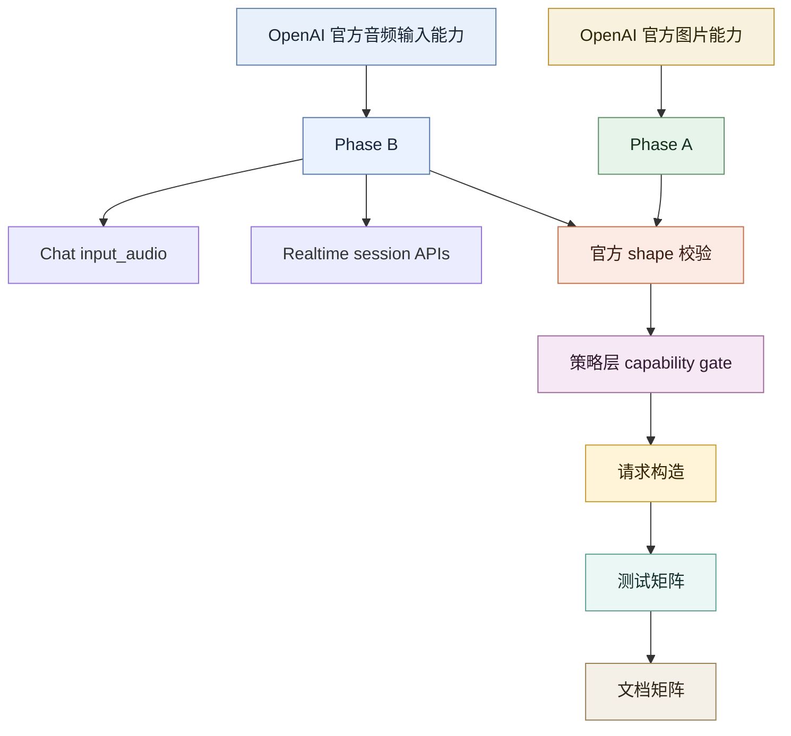

Updated: 2026-04-29 02:10:01 EEST

# OpenAI Multimodal Phase A/B Plan

## 背景

该文档最初用于定义 OpenAI multimodal 的分阶段补齐范围。按当前仓库状态，Phase A / Phase B 的主链路、测试和对外文档边界已经收口，本文档现在作为范围基线与验收记录保留。

这次工作的核心不是“再扩功能”，而是把下面几条边界固定下来，避免后续文档再次漂移：

- `Phase A` 只承诺图片输入，且必须区分 OpenAI 与 Azure OpenAI 在 Responses 图片输入上的差异。
- `Phase B` 包含 Chat `input_audio` 与 Realtime bootstrap HTTP surfaces，但不包含 transport runtime。
- 历史文档里把 `Realtime` 写成“不做”或把 `Responses input_audio` 写成可用能力，都是需要持续防回归的错误表述。

## 范围定义

### Phase A：Vision / 图片能力

以 OpenAI 官方当前文档为准，Phase A 只覆盖图片输入相关能力：

- `chat.completions.create()`
  - `image_url`
  - 多图输入
  - `detail`
- `responses.create()`
  - `input_image`
  - OpenAI: `image_url` / base64 data URL / `file_id`
  - Azure OpenAI: `image_url` / base64 data URL
  - `detail`

不包含：

- `input_audio`
- transcription / translation / speech
- `Realtime`
- 视频输入
- image generation

### Phase B：Audio Multimodal / 音频输入能力

以 OpenAI 官方当前文档为准，Phase B 覆盖：

- `chat.completions.create()`
  - `input_audio`
- `Realtime`
  - 会话创建入口
  - 客户端临时密钥创建入口
  - 实时转写会话创建入口

明确不包含：

- telephony / SIP calls 系列接口
- `responses.create()` 音频输入
  - 当前 Priorai adapter 仍明确拒绝
- transcription / translation / speech
  - 这些属于独立 API，不是“把音频作为同一模型输入”的能力

## 当前对齐矩阵

| Phase | Endpoint | 输入 shape | Priorai 目标 |
|------|------|------|------|
| A | Chat Completions | `image_url` | 完整支持 |
| A | Responses | `input_image` | 完整支持 |
| A | Chat / Responses | 视频输入 | 明确拒绝 |
| B | Chat Completions | `input_audio` | 完整支持 |
| B | Responses | `input_audio` | 明确拒绝 |
| B | Realtime | session / client secret / transcription session | 提供 SDK 入口 |

## 成功标准

### Phase A

1. OpenAI / Azure OpenAI 图片输入按官方 shape 工作。
   验证：`Chat image_url`、`Responses input_image` 在已承诺场景有构造测试与能力判断测试；其中 Azure OpenAI `input_image` 仅接受 URL / data URL，不接受 `file_id`。
2. fallback / load balance 不会把 OpenAI 图片请求静默降级到不兼容 provider。
   验证：策略测试覆盖图片请求在不支持 target 上的明确报错。
3. 文档明确区分 `Chat image_url` 与 `Responses input_image`。
   验证：`README.md`、`docs/MULTIMODAL_INPUTS.md`、本计划文档一致。

### Phase B

1. OpenAI / Azure OpenAI `Chat input_audio` 原生 shape 完整支持。
   验证：请求构造测试、能力判断测试、策略测试通过。
2. `Responses input_audio` 继续按当前 adapter 边界明确拒绝。
   验证：构造测试和文档同时说明拒绝原因。
3. Priorai 暴露可用的 `Realtime` SDK 入口。
   验证：至少能创建 session / client secret / transcription session，请求 URL、headers、body 正确；当前仅封装 bootstrap HTTP surfaces，不封装 WebSocket / WebRTC transport runtime。
4. 文档中不再把 `Realtime` 写成架构性非目标。
   验证：相关计划和 README / provider docs 同步更新。

## 当前代码现状

### 已完成

- OpenAI `Responses input_image` 已覆盖 URL、base64 data URL、`file_id` 的构造与能力判断。
- Azure OpenAI `Responses input_image` 已明确收紧为仅接受 URL / data URL，并拒绝 `file_id`。
- OpenAI / Azure OpenAI `Chat input_audio` 已有直接构造测试。
- `Responses input_audio` 已被明确拒绝。
- `priorai.realtime.sessions.create()`、`priorai.realtime.clientSecrets.create()`、`priorai.realtime.transcriptionSessions.create()` 已公开。

### 文档收口要求

- 对外文档必须明确区分 OpenAI 与 Azure OpenAI 在 `responses.create()` 图片输入上的差异。
- `Realtime` 只能宣称为 bootstrap HTTP surfaces，不能写成完整 transport runtime。
- 任何文档都不能再把 `Chat input_audio` 写成未实现，也不能把 `Responses input_audio` 写成可用能力。

## 实施顺序

### 步骤 1：补齐 Phase A 测试与文档矩阵

验证：

- `providerRequest` 覆盖 `input_image` URL / base64 / `file_id`
- `multimodalCapabilities` 覆盖图片 source kind 推断
- 文档能力矩阵与行为一致

### 步骤 2：补齐 Phase B Chat Audio

验证：

- `providerRequest` 覆盖 OpenAI / Azure OpenAI `input_audio`
- `multimodalCapabilities` 覆盖 chat audio 能力判断
- fallback / load balance 针对音频请求的拒绝逻辑可验证

### 步骤 3：实现 Realtime SDK 入口

建议最小 surface：

- `priorai.realtime.sessions.create()`
- `priorai.realtime.clientSecrets.create()`
- `priorai.realtime.transcriptionSessions.create()`

验证：

- URL 正确
- 请求头正确
- body 透传或按 provider config 变换正确
- OpenAI 可用，Azure 若无明确官方对齐路径则明确标注支持边界

### 步骤 4：统一文档与计划

验证：

- `README.md`
- `docs/MULTIMODAL_INPUTS.md`
- `docs/PROVIDERS.md`
- `docs/plan/OPENAI_VISION_COMPLETION_PLAN.md`
- `docs/plan/PORTKEY_DIFF_REPORT.md`

## 风险与取舍

### 风险 1：Realtime 全量能力过大

处理：

- 本批次只实现 HTTP 入口，不在 SDK 内部封装 WebSocket / WebRTC transport。
- 这仍然属于“接上官方能力入口”，但不假装自己实现了完整 transport runtime。

### 风险 2：Azure Realtime 与 OpenAI Realtime 不完全同构

处理：

- OpenAI 作为 Phase B 主目标。
- Azure 只在当前已有 provider config 能稳定表达的范围内接入。
- 不能稳定表达的部分明确抛错并写进文档。

### 风险 3：旧文档互相冲突

处理：

- 本文档作为新的总计划基线。
- 旧 vision-only 文档保留，但必须更新为“Phase A 子计划”，不能继续宣称覆盖全部 multimodal。

## 目标结构

## 结论

这次实施不应继续围绕“一个模糊的 OpenAI multimodal”来展开，而应该拆成：

- `Phase A`: 图片能力完全收口
- `Phase B`: 音频输入与 Realtime 入口接入

只有这样，才能把“OpenAI 有的能力我们都接上”变成可验证的交付，而不是继续停留在宽泛表述上。
