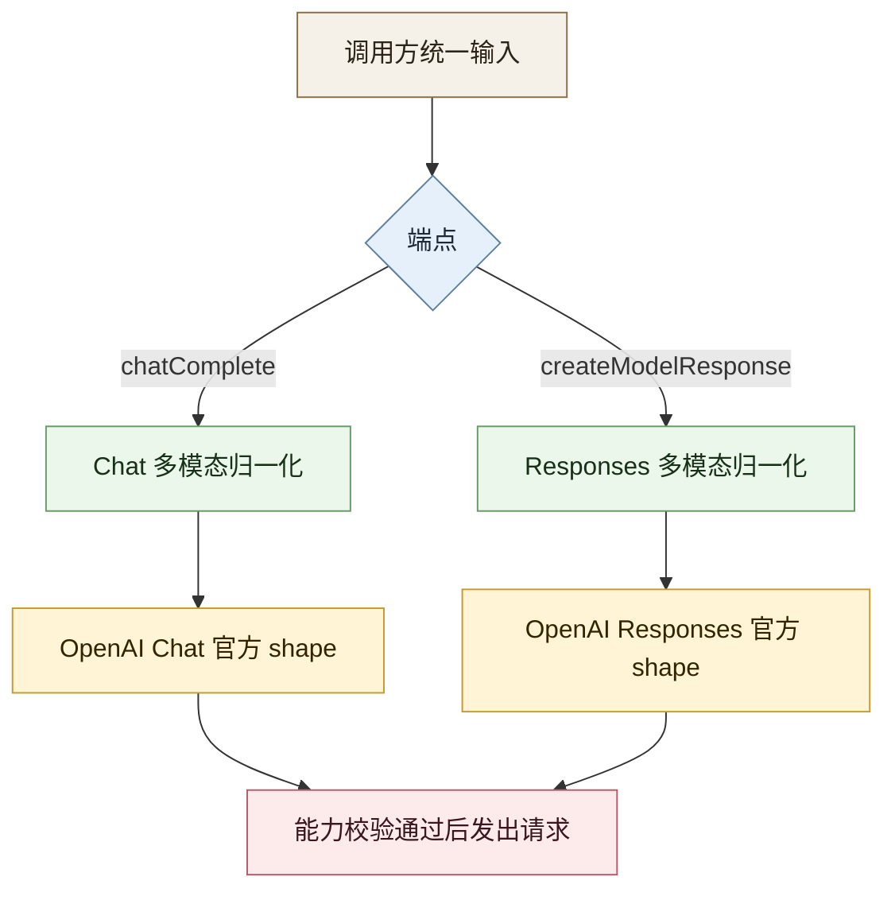

Updated: 2026-04-29 00:25 EEST

# OpenAI Vision 完整补齐计划

## 背景

当前 Priorai 对 OpenAI 的图片理解支持处于“部分可用”状态：

- `chat.completions` 路径下，OpenAI 风格的 `image_url` 已可工作。
- Priorai 自定义的 `input_file + image/*` 也能在 `chatComplete` 路径被归一化到 OpenAI 兼容 shape。
- 但 `responses.create()` 的图片输入链路没有被完整建模、校验与测试。

这不是小修小补能彻底收口的问题。当前缺口同时存在于：

- SDK 对外请求类型
- 多模态能力判断
- provider 归一化逻辑
- 测试覆盖
- 对外文档契约

## 本次目标

本计划的“做完”定义如下：

1. OpenAI `chat.completions` 的图片理解路径在 Priorai 统一输入抽象下完整、明确、可测试。
   验证：`input_file(image/*)`、原生 `image_url`、`file_id` 场景有单测与集成测试。
2. OpenAI `responses.create()` 的图片理解路径按官方 shape 完整接通。
   验证：`input[].content[].type = input_image` 的 URL、base64、`file_id` 场景有请求构建测试与路由测试。
3. 多模态能力判断对 `chatComplete` 与 `createModelResponse` 一致生效。
   验证：错误 provider 不会被误路由，支持 provider 不会被误拒绝。
4. 文档与代码行为一致，不再把“SDK 没类型”误写成根因。
   验证：`README.md`、`docs/MULTIMODAL_INPUTS.md`、必要的计划文档说明同步更新。

## 非目标

- 不在本批次实现 OpenAI 视频理解，因为官方通用推理输入未暴露 `input_video` / `video_url`。
- 不把高波动的模型级能力矩阵并入本批次。
  原因：这会把范围从“补齐 OpenAI vision 功能”扩张到“全局 capability registry 重构”，风险不成比例。
- 不补远程文件抓取代理层。
  原因：这会引入超时、大小限制、成本和安全语义变化，不是 vision 补齐的必要条件。

## 研究结论

### 1. OpenAI 官方输入 shape 不是一个统一的 `vision` 块

官方可确认的通用输入类型是：

- Chat Completions：`text`、`image_url`、`input_audio`、`file`
- Responses：`input_text`、`input_image`、`input_audio`、`input_file`

未发现官方通用推理输入支持：

- `input_video`
- `video_url`

官方参考：

- Chat API content parts
  https://developers.openai.com/api/docs/api-reference/chat/create
- Images guide / Responses image example
  https://developers.openai.com/api/docs/guides/images
- Vision guide
  https://platform.openai.com/docs/guides/vision

本地 `openai-sdk` 也印证这一点：

- Chat 仅暴露 `image_url` / `input_audio` / `file`
- Responses 暴露 `input_image` / `input_audio` / `input_file`

### 2. 当前仓库的主要不完整点

#### 2.1 `responses.create()` 输入类型建模错误

当前 [src/types/requestBody.ts](/Users/ns/codebase/xab/priorai/src/types/requestBody.ts:232) 中：

- `Params.input` 仍是 `string | string[] | EmbedInput[]`

这不符合 OpenAI Responses 的真实输入结构。仓库内其实已经有更接近官方的类型：

- [src/types/modelResponses.ts](/Users/ns/codebase/xab/priorai/src/types/modelResponses.ts:1423)

但它没有被用于 `Params.input` 的请求建模。

#### 2.2 多模态能力判断只扫描 `messages`

当前 [src/core/multimodalCapabilities.ts](/Users/ns/codebase/xab/priorai/src/core/multimodalCapabilities.ts:71) 的 `inferMultimodalRequirements()` 只遍历 `params.messages`。

结果：

- `responses.create({ input: [...] })` 的图片输入不会被完整识别
- `createModelResponse` 端点的 capability gate 与实际请求体脱节

#### 2.3 归一化只覆盖 `chatComplete`

当前 [src/core/multimodalCapabilities.ts](/Users/ns/codebase/xab/priorai/src/core/multimodalCapabilities.ts:282) 的 `normalizeMultimodalParamsForProvider()` 只在 `endpoint === 'chatComplete'` 时生效。

结果：

- `Responses` 没有自己的多模态归一化入口
- Chat 和 Responses 被错误地共享同一套输入假设

#### 2.4 文档表述把症状写成原因

当前 [docs/MULTIMODAL_INPUTS.md](/Users/ns/codebase/xab/priorai/docs/MULTIMODAL_INPUTS.md:63) 写的是：

- OpenAI 不支持视频，因为 SDK types 没暴露 `input_video`

这不准确。更准确的根因是：

- OpenAI 官方 Chat / Responses 通用输入类型当前不定义视频理解输入

#### 2.5 Chat 路径还有一个次级 shape 风险

当前 OpenAI Chat 的 `input_file(image/*)` 归一化会向 `image_url` 对象附带 `mime_type`：

- 见 [src/core/multimodalCapabilities.ts](/Users/ns/codebase/xab/priorai/src/core/multimodalCapabilities.ts:201)

但本地 `openai-sdk` 的 Chat `image_url` 类型只明确包含：

- `url`
- `detail`

`mime_type` 更像内部路由辅助字段，不应继续作为 OpenAI Chat 出站 payload 的正式一部分。

## 设计原则

1. Chat 和 Responses 分开建模，不复用错误 shape。
2. Priorai 统一抽象保留，但只在 provider 出站前做端点定向归一化。
3. 图片语义优先走官方图片输入块。
   Chat 用 `image_url`，Responses 用 `input_image`。
4. `file_id` 视为 provider 侧资产引用，不做跨 provider 盲目 fallback。
5. 文档、类型、归一化、测试必须同批完成，否则这次改动仍然是不完整的。

## 目标结构

## 实施计划

### 阶段 1：修正请求类型契约

步骤：

1. 为 `Params.input` 引入面向 Responses 的请求类型，优先复用现有 `modelResponses` 中的 `ResponseInputItem` / `EasyInputMessage` / `ResponseInputMessageContentList`。
   验证：TypeScript 可以表达 `input_image`、`input_audio`、`input_file`、字符串输入以及 message item 数组。
2. 为 Priorai 自定义统一输入补最小必要类型。
   验证：`input_file` 可在 Chat 和 Responses 两条链路进入归一化层。
3. 明确图片 detail 字段约束。
   验证：Chat 支持 `auto|low|high`，Responses 支持 `auto|low|high|original`，类型不再混淆。

注意：

- 不要为了类型好看重做整个请求模型。
- 只改与 OpenAI vision 补齐直接相关的部分。

### 阶段 2：拆分 Chat / Responses 多模态归一化

步骤：

1. 保留 `normalizeOpenAIChatContent()`，但仅用于 Chat。
   验证：现有 Chat 图片归一化测试继续通过。
2. 新增 `normalizeOpenAIResponsesInput()` 或等价函数，专门处理 `createModelResponse`。
   验证：`input_file(image/*)` 被转成 `input_image`；文档文件仍转成 `input_file`。
3. 新增 `normalizeResponsesMultimodalParams()`，与 Chat 归一化并列。
   验证：`buildProviderRequest(..., 'createModelResponse')` 会走 Responses 归一化。
4. 清理 Chat 出站 `image_url.mime_type`。
   验证：OpenAI Chat 请求体只保留官方字段；内部路由仍可在归一化前使用 MIME 信息。

建议映射：

- Chat
  - 原生 `image_url` -> 透传
  - `input_file` + `image/*` + `url|data` -> `image_url`
  - `input_file` + `file_id` -> 视语义保留为 `file` 或在可确认图片语义时转为图片引用
- Responses
  - 原生 `input_image` -> 透传
  - `input_file` + `image/*` + `url|data` -> `input_image`
  - `input_file` + `file_id` + 图片语义 -> 优先转 `input_image.file_id`
  - `input_file` + 文档 MIME -> `input_file`

这里有一个必须面对的现实：

- `file_id` 本身不带稳定的跨 provider MIME 语义。
- 如果调用方只给 `file_id`，没有任何图片语义线索，就不能臆断它是 vision 输入。

因此实现上应允许两种安全路径：

- 有图片 MIME / 来源上下文时，归一化为图片输入
- 无图片语义时，保守保留为通用文件输入

### 阶段 3：补齐 capability gate

步骤：

1. 扩展 `inferMultimodalRequirements()`，让它同时能从 `messages` 与 `input` 读取多模态需求。
   验证：`responses.create()` 的图片请求能被识别出 `mediaKind=image`。
2. 引入按端点解析内容的辅助函数，避免把 Chat / Responses item shape 混到一起。
   验证：同一请求不会因为端点不同而被误判。
3. 保持 OpenAI 视频拒绝逻辑，但更新错误信息来源。
   验证：对 `input_video` 或 `video_url` 仍明确失败，且原因描述是 API 能力边界，不是 SDK 偶然缺字段。

### 阶段 4：补齐测试

步骤：

1. 为 `multimodalCapabilities` 增加 Responses 维度单测。
   验证：`input_image`、`input_file(image/*)`、`input_file(document)` 在 `createModelResponse` 下被正确识别。
2. 为 `buildProviderRequest` 增加 OpenAI Responses 图片归一化测试。
   验证：输出体使用 `input_image` 官方 shape。
3. 为 `tryTarget` / 路由层补 capability 拒绝测试。
   验证：不支持图片的 provider 不会吃到 Responses 图片请求。
4. 为 `Router.responses.create()` 增加至少一条结构化图片输入集成测试。
   验证：端点名、归一化、策略分发和响应转换能串起来。
5. 回归现有 Chat vision 测试。
   验证：旧路径不回归。

最低测试矩阵：

| 端点 | 输入 | 预期 |
|------|------|------|
| chatComplete | `image_url` URL | 透传 |
| chatComplete | `input_file(image/png + url)` | 转 `image_url` |
| chatComplete | `input_file(image/png + data)` | 转 `image_url(data:)` |
| createModelResponse | `input_image` URL | 透传 |
| createModelResponse | `input_file(image/png + url)` | 转 `input_image` |
| createModelResponse | `input_file(image/png + data)` | 转 `input_image` |
| createModelResponse | `input_file(pdf + file_id/url/data)` | 保持 `input_file` |
| createModelResponse | `input_video(video/mp4)` | OpenAI 明确拒绝 |

### 阶段 5：更新文档

步骤：

1. 更新 `docs/MULTIMODAL_INPUTS.md`。
   验证：OpenAI Chat 与 Responses 的图片输入 shape 被分开说明。
2. 更新 `README.md` 多模态路由描述。
   验证：不再暗示 Responses 已天然完整支持全部多模态归一化。
3. 必要时补一小段 Responses 图片使用示例。
   验证：用户能直接照抄可工作的 shape。

## 风险与处理

### 风险 1：`file_id` 图片语义不充分

问题：

- 仅凭 `file_id` 很难知道它是图片还是文档。

处理：

- 不做跨 provider 猜测。
- 只在调用方明确给出图片语义时把 `file_id` 转成 vision 输入。
- 对无法确认的 `file_id` 保守走 `file` / `input_file`。

### 风险 2：Chat 与 Responses 的字段名差异导致隐藏回归

问题：

- Chat 用 `image_url`
- Responses 用 `input_image`

处理：

- 归一化函数分离
- 单测矩阵按端点拆开

### 风险 3：文档先前承诺过宽

问题：

- 现有文档把“多模态 routing”描述得比真实实现更完整。

处理：

- 文档和测试同批提交
- 未实现的能力明确标注端点范围

## 待确认事项

以下事项不阻塞计划文档，但在实施前应明确：

1. `input_file + file_id` 且未带 MIME 时，是否允许调用方显式声明这是图片资产。
   建议：允许，但用单独字段或明确文档约定，不要隐式猜。
2. 是否要在本批次顺手为 Azure OpenAI 同步相同的 Responses 图片归一化。
   建议：一起做。当前 capability 逻辑把 `openai` 与 `azure-openai` 绑在一起，拆开做反而制造不一致。
3. 是否把 OpenAI Chat 的 `image_url.detail` 透传能力写进文档示例。
   建议：写，避免用户不知道 low/high fidelity 行为。

## 实施顺序建议

1. 类型
   验证：TS 类型编译通过
2. Responses 归一化
   验证：`buildProviderRequest` 单测通过
3. capability gate
   验证：`multimodalCapabilities` 单测通过
4. Router / strategy 集成测试
   验证：`responses.create()` 路径通过
5. 文档
   验证：示例与测试一致

这个顺序不能反过来。先改文档或先补策略测试都不稳，因为请求类型和归一化层当前就是错位的。

## 参考证据

官方文档：

- Chat API content parts
  https://developers.openai.com/api/docs/api-reference/chat/create
- Responses image example
  https://developers.openai.com/api/docs/guides/images
- Vision guide
  https://platform.openai.com/docs/guides/vision

本地参考实现与类型：

- [src/core/multimodalCapabilities.ts](/Users/ns/codebase/xab/priorai/src/core/multimodalCapabilities.ts)
- [src/core/providerRequest.ts](/Users/ns/codebase/xab/priorai/src/core/providerRequest.ts)
- [src/types/requestBody.ts](/Users/ns/codebase/xab/priorai/src/types/requestBody.ts)
- [src/types/modelResponses.ts](/Users/ns/codebase/xab/priorai/src/types/modelResponses.ts)
- [tests/unit/providerRequest.test.ts](/Users/ns/codebase/xab/priorai/tests/unit/providerRequest.test.ts)
- [docs/MULTIMODAL_INPUTS.md](/Users/ns/codebase/xab/priorai/docs/MULTIMODAL_INPUTS.md)
- [docs/plan/MULTIMODAL_FOLLOW_UP_PLAN.md](/Users/ns/codebase/xab/priorai/docs/plan/MULTIMODAL_FOLLOW_UP_PLAN.md)

## 结论

这次不应该再把问题理解成“补一个 vision 开关”。

真实问题是：

- Priorai 目前只把 OpenAI Chat 的图片输入接了半条链路
- Responses 的图片输入在类型、能力判断、归一化、测试四层都没有闭环

按本计划实施后，才能把“OpenAI vision 支持已补齐”这句话说稳。
