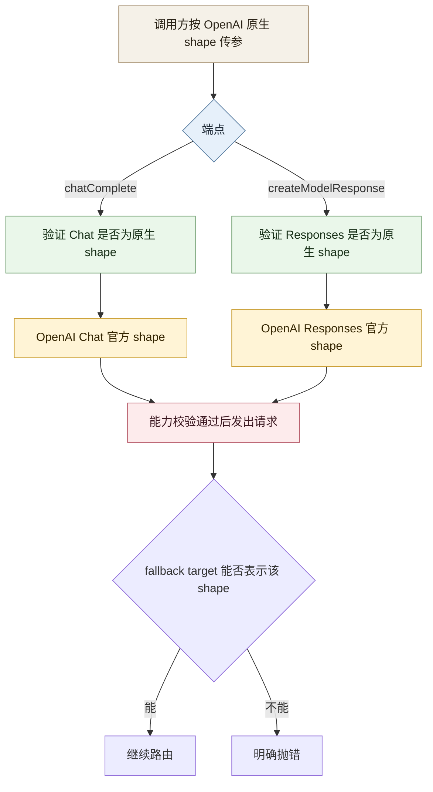

Updated: 2026-04-29 01:55:42 EEST

# OpenAI Vision 完整补齐计划

## 背景

该计划最初用于收口 OpenAI / Azure OpenAI 的图片输入能力。按当前仓库状态，主链路已经接通，本文档保留为 Phase A 子计划与验收记录。

在当前代码中：

- `chat.completions` 路径下，OpenAI 原生 `image_url` 已可工作。
- OpenAI / Azure OpenAI 对 Priorai 私有 `input_file(image/*)` 的隐式兼容已经移除。
- `responses.create()` 的图片输入链路已经建模、校验并补上测试。
- Azure OpenAI `responses.create()` 当前仅接受 `input_image.image_url`（HTTPS URL 或 data URL），不接受 `input_image.file_id`。

原始实施期的难点集中在：

- SDK 对外请求类型
- 多模态能力判断
- provider 归一化逻辑
- 测试覆盖
- 对外文档契约

## 当前验收目标

本计划的“做完”定义如下：

1. OpenAI `chat.completions` 的图片理解路径严格按 OpenAI 官方 shape 工作。
   验证：仅原生 `image_url` 与官方 `file` shape 被承诺支持；不再把 Priorai 自定义 `input_file(image/*)` 当成 OpenAI provider 契约的一部分。
2. OpenAI `responses.create()` 的图片理解路径按 OpenAI 官方 shape 完整接通。
   验证：`input[].content[].type = input_image` 的 URL、base64、`file_id` 场景有请求构建测试与路由测试。
3. Azure OpenAI `responses.create()` 的图片理解路径按当前适配器边界收紧。
   验证：`input_image.image_url` 的 URL、base64 data URL 场景通过；`input_image.file_id` 明确拒绝。
4. 多模态能力判断对 `chatComplete`、`createModelResponse`、`openai`、`azure-openai` 一致生效。
   验证：fallback 到不支持该 OpenAI 原生输入 shape 的 target 时明确抛错，不做隐式降级或个性化重写。
5. 文档与代码行为一致，不再把“SDK 没类型”误写成根因。
   验证：`README.md`、`docs/MULTIMODAL_INPUTS.md`、必要的计划文档说明同步更新。

## 非目标

- 不在本批次实现 OpenAI 视频理解，因为官方通用推理输入未暴露 `input_video` / `video_url`。
- 不把高波动的模型级能力矩阵并入本批次。
  原因：这会把范围从“补齐 OpenAI vision 功能”扩张到“全局 capability registry 重构”，风险不成比例。
- 不补远程文件抓取代理层。
  原因：这会引入超时、大小限制、成本和安全语义变化，不是 vision 补齐的必要条件。
- 不为 OpenAI provider 保留 Priorai 自定义多模态输入兼容层。
  原因：这会让对外 OpenAI 接口变成“看起来像 OpenAI，实际不是 OpenAI”。

## 研究结论

### 1. OpenAI 官方输入 shape 不是一个统一的 `vision` 块

官方可确认的通用输入类型是：

- Chat Completions：`text`、`image_url`、`input_audio`、`file`
- Responses：`input_text`、`input_image`、`input_file`

未发现官方通用推理输入支持：

- `input_video`
- `video_url`

官方参考：

- Chat API content parts
  https://developers.openai.com/api/docs/api-reference/chat/create
- Images guide / Responses image example
  https://developers.openai.com/api/docs/guides/images
- Vision guide
  https://platform.openai.com/docs/guides/vision

本地 `openai-sdk` 也印证这一点：

- Chat 仅暴露 `image_url` / `input_audio` / `file`
- Responses 暴露 `input_image` / `input_file`

### 2. 实施期识别出的主要问题

#### 2.1 `responses.create()` 输入类型建模错误

当前 [src/types/requestBody.ts](/Users/ns/codebase/xab/priorai/src/types/requestBody.ts:232) 中：

- `Params.input` 仍是 `string | string[] | EmbedInput[]`

这不符合 OpenAI Responses 的真实输入结构。仓库内其实已经有更接近官方的类型：

- [src/types/modelResponses.ts](/Users/ns/codebase/xab/priorai/src/types/modelResponses.ts:1423)

但它没有被用于 `Params.input` 的请求建模。

#### 2.2 多模态能力判断只扫描 `messages`

当前 [src/core/multimodalCapabilities.ts](/Users/ns/codebase/xab/priorai/src/core/multimodalCapabilities.ts:71) 的 `inferMultimodalRequirements()` 只遍历 `params.messages`。

结果：

- `responses.create({ input: [...] })` 的图片输入不会被完整识别
- `createModelResponse` 端点的 capability gate 与实际请求体脱节

#### 2.3 OpenAI provider 当前混入了非原生兼容层

当前 [src/core/multimodalCapabilities.ts](/Users/ns/codebase/xab/priorai/src/core/multimodalCapabilities.ts:192) 中，OpenAI Chat 会把 Priorai 自定义的 `input_file(image/*)` 改写成 `image_url`。

这带来两个问题：

- OpenAI provider 的对外契约被 Priorai 自定义输入污染
- 用户以为自己在调用 OpenAI 接口，实际上调用的是一层 Priorai 私有方言

本计划改为：

- OpenAI / Azure OpenAI 仅承诺原生 OpenAI shape
- 非原生输入在 OpenAI provider 上直接失败，而不是偷偷归一化

#### 2.4 `Responses` 输入校验与能力判断仍不完整

当前 [src/core/multimodalCapabilities.ts](/Users/ns/codebase/xab/priorai/src/core/multimodalCapabilities.ts:282) 的 `normalizeMultimodalParamsForProvider()` 只在 `endpoint === 'chatComplete'` 时生效。

结果：

- `Responses` 没有自己的多模态归一化入口
- Chat 和 Responses 被错误地共享同一套输入假设

#### 2.5 文档表述把症状写成原因

当前 [docs/MULTIMODAL_INPUTS.md](/Users/ns/codebase/xab/priorai/docs/MULTIMODAL_INPUTS.md:63) 写的是：

- OpenAI 不支持视频，因为 SDK types 没暴露 `input_video`

这不准确。更准确的根因是：

- OpenAI 官方 Chat / Responses 通用输入类型当前不定义视频理解输入

#### 2.6 Chat 路径还有一个次级 shape 风险

当前 OpenAI Chat 的 `input_file(image/*)` 归一化会向 `image_url` 对象附带 `mime_type`：

- 见 [src/core/multimodalCapabilities.ts](/Users/ns/codebase/xab/priorai/src/core/multimodalCapabilities.ts:201)

但本地 `openai-sdk` 的 Chat `image_url` 类型只明确包含：

- `url`
- `detail`

`mime_type` 更像内部路由辅助字段，不应继续作为 OpenAI Chat 出站 payload 的正式一部分。

## 设计原则

1. OpenAI provider 对外接口严格对齐 OpenAI 官方 shape，不引入 Priorai 私有输入方言。
2. Chat 和 Responses 分开建模，不复用错误 shape。
3. 图片语义优先走官方图片输入块。
   Chat 用 `image_url`，Responses 用 `input_image`。
4. `file_id` 视为 provider 侧资产引用，不做跨 provider 盲目 fallback，也不猜图片语义。
5. fallback 到其它 provider 时，只要目标无法表示当前 OpenAI 原生多模态请求，就明确抛错。
6. 文档、类型、能力判断、测试必须同批完成，否则这次改动仍然是不完整的。

## 目标结构

## 实施计划

### 阶段 1：修正请求类型契约

步骤：

1. 为 `Params.input` 引入面向 Responses 的请求类型，优先复用现有 `modelResponses` 中的 `ResponseInputItem` / `EasyInputMessage` / `ResponseInputMessageContentList`。
   验证：TypeScript 可以表达 `input_image`、`input_file`、字符串输入以及 message item 数组。
2. 明确 OpenAI Chat 与 Responses 的原生图片字段约束。
   验证：Chat 支持 `auto|low|high`，Responses 支持 `auto|low|high|original`，类型不再混淆。
3. 把 OpenAI provider 不承诺支持的 Priorai 私有多模态输入从类型和文档契约中剥离。
   验证：OpenAI / Azure OpenAI 对外接口描述不再出现“`input_file(image/*)` 也可以”这类说法。

注意：

- 不要为了类型好看重做整个请求模型。
- 只改与 OpenAI vision 补齐直接相关的部分。
- 这里的目标不是“让更多 shape 能跑”，而是“让承诺的 shape 与 OpenAI 完全一致”。

### 阶段 2：清理 OpenAI provider 的非原生兼容层

步骤：

1. 移除或停用 OpenAI Chat 对 Priorai 自定义 `input_file(image/*)` 的隐式归一化。
   验证：OpenAI Chat 只接受原生 `image_url` / `file` shape。
2. 不为 OpenAI Responses 新增“把 `input_file(image/*)` 改写成 `input_image`”的兼容入口。
   验证：OpenAI Responses 只接受原生 `input_image` / `input_file` shape。
3. 清理 Chat 出站 `image_url.mime_type`。
   验证：OpenAI Chat 请求体只保留官方字段；内部路由仍可在归一化前使用 MIME 信息。

接受的 OpenAI 原生路径：

- Chat
  - 原生 `image_url` -> 透传
  - 原生 `file` -> 透传
- Responses
  - 原生 `input_image` -> 透传
  - 原生 `input_file` -> 透传

拒绝的路径：

- OpenAI Chat 上的 Priorai 私有 `input_file(image/*)` 自动改写
- OpenAI Responses 上的 Priorai 私有 `input_file(image/*)` 自动改写
- 仅凭 `file_id` 猜测图片语义并自动转 vision 输入

### 阶段 3：补齐 capability gate 与 fallback 抛错

步骤：

1. 扩展 `inferMultimodalRequirements()`，让它同时能从 `messages` 与 `input` 读取 OpenAI 原生多模态需求。
   验证：`responses.create()` 的 `input_image` 请求能被识别出 `mediaKind=image`。
2. 为 OpenAI / Azure OpenAI 增加原生 shape 校验。
   验证：非原生 Priorai 私有输入在 OpenAI provider 上直接失败，而不是被偷偷接受。
3. 引入按端点解析内容的辅助函数，避免把 Chat / Responses item shape 混到一起。
   验证：同一请求不会因为端点不同而被误判。
4. 保持 OpenAI 视频拒绝逻辑，但更新错误信息来源。
   验证：对 `input_video` 或 `video_url` 仍明确失败，且原因描述是 API 能力边界，不是 SDK 偶然缺字段。
5. 在 fallback / load balance 中明确要求目标必须能表示当前 OpenAI 原生输入 shape。
   验证：fallback 到不支持 `input_image` 或 `image_url` 的 provider 时抛出结构化错误，不做隐式降级。

### 阶段 4：补齐测试

步骤：

1. 为 `multimodalCapabilities` 增加 Responses 维度单测。
   验证：`input_image`、`input_file(document)` 在 `createModelResponse` 下被正确识别，非原生私有输入在 OpenAI provider 上被拒绝。
2. 为 `buildProviderRequest` 增加 OpenAI Responses 原生图片 shape 测试。
   验证：原生 `input_image` 透传，`input_file(image/*)` 不再被 OpenAI provider 特判成图片输入。
3. 为 `tryTarget` / 路由层补 capability 拒绝测试。
   验证：不支持图片的 provider 不会吃到 OpenAI 原生图片请求；fallback 时明确抛错。
4. 为 `Router.responses.create()` 增加至少一条结构化图片输入集成测试。
   验证：端点名、归一化、策略分发和响应转换能串起来。
5. 回归现有 Chat vision 测试，并修正与新契约冲突的旧测试。
   验证：原生路径保留，私有兼容路径被删除或改为拒绝测试。

最低测试矩阵（当前已落实）：

| 端点 | 输入 | 预期 |
|------|------|------|
| chatComplete | `image_url` URL | 透传 |
| chatComplete | `file.file_id` | 透传 |
| chatComplete | `input_file(image/png + url)` | OpenAI provider 明确拒绝 |
| createModelResponse | `input_image` URL | 透传 |
| createModelResponse | `input_image` file_id | OpenAI 透传 |
| createModelResponse | `input_image` file_id | Azure OpenAI 明确拒绝 |
| createModelResponse | `input_file(image/png + url)` | OpenAI provider 明确拒绝 |
| createModelResponse | `input_file(pdf + file_id/url/data)` | 保持 `input_file` |
| createModelResponse | `input_audio` | OpenAI 明确拒绝 |
| createModelResponse | `input_video(video/mp4)` | OpenAI 明确拒绝 |
| fallback | OpenAI 原生图片请求 -> 不支持 provider | 明确抛错 |

### 阶段 5：更新文档

步骤：

1. 更新 `docs/MULTIMODAL_INPUTS.md`。
   验证：OpenAI Chat 与 Responses 的图片输入 shape 被分开说明。
2. 更新 `README.md` 多模态路由描述。
   验证：明确说明 OpenAI / Azure OpenAI provider 只承诺 OpenAI 原生 shape，不接受 Priorai 私有多模态输入变体。
3. 必要时补一小段 Responses 图片使用示例。
   验证：用户能直接照抄可工作的 shape。

## 风险与处理

### 风险 1：`file_id` 图片语义不充分

问题：

- 仅凭 `file_id` 很难知道它是图片还是文档。

处理：

- 不做跨 provider 猜测。
- 不自动把 `file_id` 解释成 vision 输入。
- 只接受调用方显式使用 OpenAI 原生图片字段表达图片语义。

### 风险 2：Chat 与 Responses 的字段名差异导致隐藏回归

问题：

- Chat 用 `image_url`
- Responses 用 `input_image`

处理：

- 按端点分开做 shape 校验
- 单测矩阵按端点拆开

### 风险 3：文档先前承诺过宽

问题：

- 现有文档把“多模态 routing”描述得比真实实现更完整。

处理：

- 文档和测试同批提交
- 未实现的能力明确标注端点范围

## 待确认事项

以下事项已在本计划中固定，不再作为开放决策：

1. OpenAI / Azure OpenAI 只接受 OpenAI 原生多模态 shape。
2. `file_id` 不猜图片语义。
3. Azure OpenAI 与 OpenAI 同批处理。

仍需在实施时顺手完成的细节：

1. 把 OpenAI Chat 的 `image_url.detail` 透传能力写进文档示例。
2. 给 fallback 失败错误补一条足够清楚的用户可读信息。

## 实施顺序建议

1. 类型
   验证：TS 类型编译通过
2. 删除 OpenAI provider 的私有兼容层
   验证：非原生输入被拒绝
3. capability gate 与 fallback 抛错
   验证：`multimodalCapabilities` 与路由测试通过
4. Router / strategy 集成测试
   验证：`responses.create()` 与 `chat.completions.create()` 原生 vision 路径通过
5. 文档
   验证：示例与测试一致

这个顺序不能反过来。先不把契约收紧，后面的 capability 和测试都会继续围绕错误接口打转。

## 参考证据

官方文档：

- Chat API content parts
  https://developers.openai.com/api/docs/api-reference/chat/create
- Responses image example
  https://developers.openai.com/api/docs/guides/images
- Vision guide
  https://platform.openai.com/docs/guides/vision

本地参考实现与类型：

- [src/core/multimodalCapabilities.ts](/Users/ns/codebase/xab/priorai/src/core/multimodalCapabilities.ts)
- [src/core/providerRequest.ts](/Users/ns/codebase/xab/priorai/src/core/providerRequest.ts)
- [src/types/requestBody.ts](/Users/ns/codebase/xab/priorai/src/types/requestBody.ts)
- [src/types/modelResponses.ts](/Users/ns/codebase/xab/priorai/src/types/modelResponses.ts)
- [tests/unit/providerRequest.test.ts](/Users/ns/codebase/xab/priorai/tests/unit/providerRequest.test.ts)
- [docs/MULTIMODAL_INPUTS.md](/Users/ns/codebase/xab/priorai/docs/MULTIMODAL_INPUTS.md)
- [docs/plan/MULTIMODAL_FOLLOW_UP_PLAN.md](/Users/ns/codebase/xab/priorai/docs/plan/MULTIMODAL_FOLLOW_UP_PLAN.md)

## 结论

这次不应该再把问题理解成“补一个 vision 开关”。

真实问题是：

- Priorai 目前对 OpenAI provider 混入了不该有的私有输入兼容层
- Responses 的图片输入在类型、能力判断、测试三层都没有闭环
- fallback 到其它 provider 的失败语义还没有被明确写成对外契约

按本计划实施后，才能把“OpenAI provider 的 vision 能力已按官方接口完整实现”这句话说稳。
