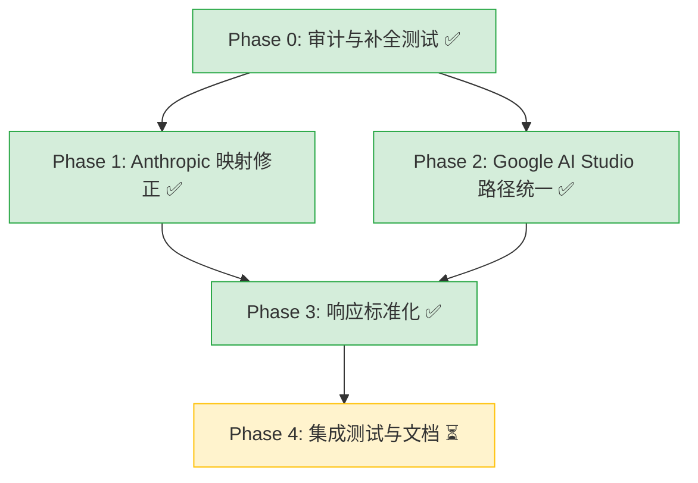

# Schema 标准化开发计划

> 更新时间：2026-04-26 16:56 EEST
> 状态：Phase 0-3 已完成，Phase 4 待执行

---

## 1. 背景与目标

### 核心问题

不同 provider 的结构化输出 API 格式完全不同，调用方不应感知这些差异。当使用 fallback 策略（如 `gemini-2.5-flash → gpt-4o-mini → claude-haiku`）时，不可能也不应该针对每个 provider 维护不同的 schema 格式。

### 架构决策

调用方统一使用 OpenAI `response_format.json_schema` 格式（当前事实标准），priorai 内部各 provider transformer 负责转换为各自的原生格式。

---

## 2. 各 Provider 结构化输出现状（经代码查证）

### 2.1 格式对比

| Provider | 原生机制 | nullable 写法 | 特殊要求 |
|----------|---------|--------------|---------|
| OpenAI | `response_format.json_schema` | `anyOf: [{type:'string'},{type:'null'}]` | strict 模式需 `additionalProperties: false` |
| Anthropic | `output_config.format: { type: 'json_schema', schema }` | 标准 JSON Schema | 原生支持，不再需要 tool_use 模拟 |
| Google AI Studio | `generationConfig.responseJsonSchema`（原生 JSON Schema 透传） | 标准 JSON Schema | 需 `responseMimeType: 'application/json'` |
| Google Vertex AI | `generationConfig.responseJsonSchema`（原生 JSON Schema 透传） | 标准 JSON Schema | 需 `responseMimeType: 'application/json'` |
| OpenRouter | 透传 OpenAI 格式 | 同 OpenAI | 服务端负责转换 |
| Bedrock | `additionalModelRequestFields.response_format` | 同 OpenAI | 透传 |

### 2.2 重要发现（与原文档差异）

**Anthropic 已原生支持结构化输出：**
- Anthropic SDK 定义了 `OutputConfig.format: JSONOutputFormat | null`
- `JSONOutputFormat = { type: 'json_schema', schema: Record<string, unknown> }`
- priorai 的 `buildAnthropicOutputConfig()` 已修正为正确映射
- **结论：原文档中"Anthropic 无原生 JSON schema 输出，需用 tool_use 模拟"已过时，无需实现 tool_use 模拟方案**

**Google 两条路径已统一：**
- AI Studio 和 Vertex AI 现在都使用 `responseJsonSchema` 直接透传 JSON Schema
- Google GenAI SDK v1.9.0+ 及 Context7 文档均确认 AI Studio 端点支持 `responseJsonSchema`
- `transformGeminiToolParameters()` 和 `recursivelyDeleteUnsupportedParameters()` 仅用于 tool parameters 转换，不再用于 response_format 路径

### 2.3 priorai 现有实现盘点

| 组件 | 文件 | 状态 |
|------|------|------|
| `buildAnthropicOutputConfig()` | `providers/anthropic/chatComplete.ts` | ✅ 已修正，映射到 `output_config.format.json_schema` |
| `transformGeminiToolParameters()` | `providers/google-vertex-ai/utils.ts` | ✅ 已实现，仅用于 tool parameters |
| `recursivelyDeleteUnsupportedParameters()` | `providers/google-vertex-ai/utils.ts` | ✅ 已实现，仅用于 tool parameters |
| `derefer()` | `providers/google-vertex-ai/utils.ts` | ✅ 已实现，$ref 递归展开 |
| Google AI Studio `json_schema` 处理 | `providers/google/chatComplete.ts` | ✅ 已统一为 `responseJsonSchema` 透传 |
| Vertex AI `json_schema` 处理 | `providers/google-vertex-ai/transformGenerationConfig.ts` | ✅ `responseJsonSchema` 透传 |
| OpenAI / OpenRouter / Bedrock | 各自 chatComplete.ts | ✅ 透传，无需转换 |

---

## 3. 分阶段开发计划

### Phase 0：审计与补全（P0 — 前置条件）✅ 已完成

**目标：** 确保现有实现的正确性，补全缺失的测试覆盖

#### 任务清单

| # | 任务 | 状态 | 产出 |
|---|------|------|------|
| 0.1 | 为 `buildAnthropicOutputConfig()` 编写单元测试 | ✅ 完成 | `tests/unit/anthropicOutputConfig.test.ts`（10 个测试） |
| 0.2 | 为 `transformGeminiToolParameters()` 编写单元测试 | ✅ 完成 | `tests/unit/googleVertexSchemaTransform.test.ts`（迁移自 src/，18 个测试） |
| 0.3 | 为 `recursivelyDeleteUnsupportedParameters()` 编写单元测试 | ✅ 完成 | 同上文件追加（8 个测试） |
| 0.4 | 为 `derefer()` 编写单元测试 | ✅ 完成 | 同上文件（已有覆盖） |

**实际耗时：** ~1.5h（含迁移旧测试文件到 `tests/unit/`）

---

### Phase 1：Anthropic 映射修正（P1 — 高优先级）✅ 已完成

**目标：** 修正 Anthropic 的 `output_config` 映射，使其完全符合 Anthropic SDK 最新 API

#### 修正内容

```ts
// 修正前（有误）
output_config: {
  schema: { ...jsonSchema, name: schemaName }
}

// 修正后（正确）
output_config: {
  format: {
    type: 'json_schema',
    schema: jsonSchema
  }
}
```

#### 任务清单

| # | 任务 | 状态 | 产出 |
|---|------|------|------|
| 1.1 | 修改 `buildAnthropicOutputConfig()` 使用 `format.json_schema` 路径 | ✅ 完成 | `providers/anthropic/chatComplete.ts` |
| 1.2 | 更新单元测试匹配新映射 | ✅ 完成 | `tests/unit/anthropicOutputConfig.test.ts` |
| 1.3 | 导出 `buildAnthropicOutputConfig` 以支持直接测试 | ✅ 完成 | 同上 |

**实际耗时：** ~0.5h

---

### Phase 2：Google AI Studio 路径统一（P1 — 高优先级）✅ 已完成

**目标：** 将 Google AI Studio provider 从 `responseSchema`（Vertex Schema 格式）升级到 `responseJsonSchema`（原生 JSON Schema 透传），与 Vertex AI provider 统一

#### 完成状态

```
修正前：
  Google AI Studio:  responseSchema + transformGeminiToolParameters()  ← 旧路径
  Google Vertex AI:  responseJsonSchema                                ← 新路径

修正后：
  Google AI Studio:  responseJsonSchema  ← 已统一
  Google Vertex AI:  responseJsonSchema  ← 保持不变
```

#### 任务清单

| # | 任务 | 状态 | 产出 |
|---|------|------|------|
| 2.1 | 修改 `providers/google/chatComplete.ts` 的 `json_schema` 分支 | ✅ 完成 | 改用 `responseJsonSchema` 透传 |
| 2.2 | 验证 Google AI Studio API 支持 `responseJsonSchema` | ✅ 完成 | Context7 + GenAI SDK 文档确认 |
| 2.3 | 确认 `transformGeminiToolParameters()` 仍需保留 | ✅ 完成 | 仅 tool parameters 使用，保留 |

**实际耗时：** ~0.5h

---

### Phase 3：响应标准化（P1 — 高优先级）✅ 已完成

**目标：** 确保各 provider 的 structured output 响应统一转换为 OpenAI 格式

#### 审计结果

| Provider | `choices[0].message.content` 来源 | finish_reason 映射 | 状态 |
|----------|----------------------------------|-------------------|------|
| OpenAI | 透传 | 透传 | ✅ 正确 |
| Anthropic | `content[0].text` 拼接 | `end_turn` → `stop` | ✅ 正确 |
| Google AI | `candidates[0].content.parts[0].text` | `STOP` → `stop` | ✅ 正确 |
| Vertex Gemini | `candidates[0].content.parts[0].text` | `STOP` → `stop` | ✅ 正确 |
| Vertex Anthropic (非流式) | `content[0].text` 拼接 | `end_turn` → `stop` | ✅ 正确 |
| Vertex Anthropic (流式) | `delta.text` | 原始值未转换 | ✅ 已修复 |

#### 发现并修复的 Bug

**Vertex Anthropic 流式 `finish_reason` 未标准化：**
- `chatComplete.ts:1088` 直接使用 `parsedChunk.delta?.stop_reason` 而非调用 `transformFinishReason()`
- 导致 strict OpenAI compliance 模式下泄漏 Anthropic 原始值（如 `end_turn`）
- 已修复为调用 `transformFinishReason(parsedChunk.delta?.stop_reason, strictOpenAiCompliance)`

#### 任务清单

| # | 任务 | 状态 | 产出 |
|---|------|------|------|
| 3.1 | 审计 Anthropic response transform | ✅ 完成 | 确认正确 |
| 3.2 | 审计 Google response transform | ✅ 完成 | 确认正确 |
| 3.3 | 修复 Vertex Anthropic streaming finish_reason bug | ✅ 完成 | `providers/google-vertex-ai/chatComplete.ts:1088` |
| 3.4 | 编写跨 provider 响应一致性测试 | ✅ 完成 | `tests/unit/structuredOutputResponse.test.ts`（18 个测试） |

**实际耗时：** ~1h

---

### Phase 4：集成测试与文档（P2 — 收尾）⏳ 待执行

**目标：** 端到端验证 fallback 场景，更新文档

#### 任务清单

| # | 任务 | 优先级 | 预估 |
|---|------|--------|------|
| 4.1 | 编写 fallback 场景集成测试：同一 schema 在 OpenAI → Google → Anthropic 链路中的请求/响应一致性 | P2 | 2h |
| 4.2 | 编写 weighted load balancing 场景测试：同一 schema 随机分发到不同 provider | P2 | 1h |
| 4.3 | 更新 README 或 examples 中的 structured output 使用示例 | P2 | 0.5h |

**风险：**
- 低。前置 Phase 已覆盖核心逻辑

---

## 4. 总体风险评估

| 风险 | 等级 | 影响 | 状态 |
|------|------|------|------|
| Google AI Studio 不支持 `responseJsonSchema` | ~~中~~ | ~~Phase 2 需回退~~ | ✅ 已验证支持 |
| Anthropic `output_config.format` 响应格式与预期不符 | ~~中~~ | ~~响应解析错误~~ | ✅ 已审计确认正确 |
| Vertex Anthropic streaming finish_reason 不一致 | 中 | 流式响应泄漏原始值 | ✅ 已修复 |
| `derefer()` 循环引用替代方案在某些 provider 不兼容 | 低 | 特定 schema 转换失败 | ⚠️ 已有测试覆盖，待实际验证 |
| 未来 provider API 变更 | 低 | 转换逻辑失效 | ⚠️ 各 provider 独立测试，易于定位 |

---

## 5. 执行顺序与依赖关系



---

## 6. 工时统计

| Phase | 预估 | 实际 | 状态 |
|-------|------|------|------|
| Phase 0: 审计与补全测试 | 5h | ~1.5h | ✅ 完成 |
| Phase 1: Anthropic 映射修正 | 2h | ~0.5h | ✅ 完成 |
| Phase 2: Google AI Studio 路径统一 | 2.5h | ~0.5h | ✅ 完成 |
| Phase 3: 响应标准化 | 4h | ~1h | ✅ 完成 |
| Phase 4: 集成测试与文档 | 3.5h | — | ⏳ 待执行 |
| **合计** | **17h** | **~3.5h + 待定** | — |

---

## 7. 变更记录

| 日期 | Commit | 说明 |
|------|--------|------|
| 2026-04-26 16:42 | `test: add unit tests for buildAnthropicOutputConfig` | Phase 0.1 — 10 个测试锁定当前行为 |
| 2026-04-26 16:43 | `fix: correct Anthropic output_config mapping to use format.json_schema` | Phase 1 — 修正映射 + 导出函数 |
| 2026-04-26 16:44 | `test: migrate Vertex AI schema tests and add recursivelyDeleteUnsupportedParameters coverage` | Phase 0.2/0.3 — 迁移 + 8 个新测试 |
| 2026-04-26 16:45 | `fix: unify Google AI Studio to use responseJsonSchema passthrough` | Phase 2 — 统一透传路径 |
| 2026-04-26 16:48 | `fix: normalize finish_reason in Vertex Anthropic streaming transform` | Phase 3 — 修复流式 bug |
| 2026-04-26 16:54 | `test: add cross-provider structured output response consistency tests` | Phase 3.4 — 18 个跨 provider 测试 |

**测试覆盖变化：** 392 → 436（+44 个测试），全部通过
