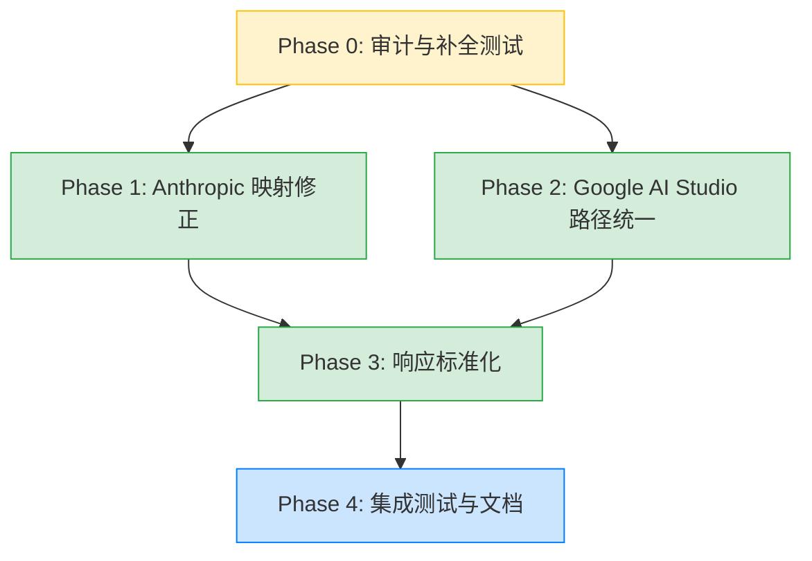

# Schema 标准化开发计划

> 更新时间：2026-04-26 16:29 EEST
> 状态：待执行

---

## 1. 背景与目标

### 核心问题

不同 provider 的结构化输出 API 格式完全不同，调用方不应感知这些差异。当使用 fallback 策略（如 `gemini-2.5-flash → gpt-4o-mini → claude-haiku`）时，不可能也不应该针对每个 provider 维护不同的 schema 格式。

### 架构决策

调用方统一使用 OpenAI `response_format.json_schema` 格式（当前事实标准），priorai 内部各 provider transformer 负责转换为各自的原生格式。

---

## 2. 各 Provider 结构化输出现状（经代码查证）

### 2.1 格式对比

| Provider | 原生机制 | nullable 写法 | 特殊要求 |
|----------|---------|--------------|---------|
| OpenAI | `response_format.json_schema` | `anyOf: [{type:'string'},{type:'null'}]` | strict 模式需 `additionalProperties: false` |
| Anthropic | `output_config.format: { type: 'json_schema', schema }` | 标准 JSON Schema | 原生支持，不再需要 tool_use 模拟 |
| Google AI Studio | `generationConfig.responseSchema`（Vertex Schema 格式） | `nullable: true` | 需 `responseMimeType: 'application/json'`；类型枚举大写 |
| Google Vertex AI | `generationConfig.responseJsonSchema`（原生 JSON Schema 透传） | 标准 JSON Schema | 需 `responseMimeType: 'application/json'` |
| OpenRouter | 透传 OpenAI 格式 | 同 OpenAI | 服务端负责转换 |
| Bedrock | `additionalModelRequestFields.response_format` | 同 OpenAI | 透传 |

### 2.2 重要发现（与原文档差异）

**Anthropic 已原生支持结构化输出：**
- Anthropic SDK 定义了 `OutputConfig.format: JSONOutputFormat | null`
- `JSONOutputFormat = { type: 'json_schema', schema: Record<string, unknown> }`
- priorai 的 `buildAnthropicOutputConfig()` 已实现此映射（`chatComplete.ts:132-153`）
- **结论：原文档中"Anthropic 无原生 JSON schema 输出，需用 tool_use 模拟"已过时，无需实现 tool_use 模拟方案**

**Google 两条路径已分化：**
- AI Studio provider（`providers/google/chatComplete.ts`）：使用 `responseSchema` + `transformGeminiToolParameters()` 做类型大写 + anyOf→nullable 转换
- Vertex AI provider（`providers/google-vertex-ai/transformGenerationConfig.ts`）：使用 `responseJsonSchema` 直接透传 JSON Schema
- Google GenAI SDK v1.9.0+ 已支持 `responseJsonSchema` 原生 JSON Schema 透传
- **结论：AI Studio provider 可以升级到 `responseJsonSchema` 路径，统一两个 Google provider 的行为**

### 2.3 priorai 现有实现盘点

| 组件 | 文件 | 状态 |
|------|------|------|
| `buildAnthropicOutputConfig()` | `providers/anthropic/chatComplete.ts:132-153` | ✅ 已实现，映射到 `output_config.schema` |
| `transformGeminiToolParameters()` | `providers/google-vertex-ai/utils.ts:333-381` | ✅ 已实现，anyOf→nullable + $ref 展开 |
| `recursivelyDeleteUnsupportedParameters()` | `providers/google-vertex-ai/utils.ts:456-464` | ✅ 已实现，白名单过滤 |
| `derefer()` | `providers/google-vertex-ai/utils.ts:302-331` | ✅ 已实现，$ref 递归展开 |
| Google AI Studio `json_schema` 处理 | `providers/google/chatComplete.ts:69-75` | ✅ 已实现，用 responseSchema 路径 |
| Vertex AI `json_schema` 处理 | `providers/google-vertex-ai/transformGenerationConfig.ts:41-46` | ✅ 已实现，用 responseJsonSchema 路径 |
| OpenAI / OpenRouter / Bedrock | 各自 chatComplete.ts | ✅ 透传，无需转换 |

---

## 3. 分阶段开发计划

### Phase 0：审计与补全（P0 — 前置条件）

**目标：** 确保现有实现的正确性，补全缺失的测试覆盖

#### 任务清单

| # | 任务 | 优先级 | 预估 |
|---|------|--------|------|
| 0.1 | 为 `buildAnthropicOutputConfig()` 编写单元测试 | P0 | 1h |
| 0.2 | 为 `transformGeminiToolParameters()` 编写单元测试（覆盖 anyOf→nullable、$ref 展开、嵌套 schema、边界情况） | P0 | 2h |
| 0.3 | 为 `recursivelyDeleteUnsupportedParameters()` 编写单元测试 | P0 | 1h |
| 0.4 | 为 `derefer()` 编写单元测试（覆盖循环引用、深层嵌套、缺失 $defs） | P0 | 1h |

**难点/注意事项：**
- `derefer()` 的循环引用处理用 `{ type: 'object' }` 替代，需验证这在各 provider 端是否产生合理结果
- `transformGeminiToolParameters()` 只处理 `anyOf`/`oneOf` 中单个非 null 项 + null 的情况，多个非 null 项 + null 的情况只设 `nullable: true` 但保留 `anyOf`，需确认 Gemini API 是否接受

**风险：**
- 低。纯测试工作，不改动业务逻辑

**测试要求：**
- 每个函数至少覆盖：正常路径、空输入、嵌套 schema、nullable 各种写法、$ref 引用、不支持字段过滤

---

### Phase 1：Anthropic 映射修正（P1 — 高优先级）

**目标：** 修正 Anthropic 的 `output_config` 映射，使其完全符合 Anthropic SDK 最新 API

#### 当前问题

`buildAnthropicOutputConfig()` 当前将 `json_schema.schema` 映射到 `output_config.schema`，但 Anthropic 最新 API 的正确路径是：

```ts
// 当前实现（有误）
output_config: {
  schema: { ...jsonSchema, name: schemaName }
}

// 正确实现
output_config: {
  format: {
    type: 'json_schema',
    schema: jsonSchema
  }
}
```

#### 任务清单

| # | 任务 | 优先级 | 预估 |
|---|------|--------|------|
| 1.1 | 修改 `buildAnthropicOutputConfig()` 使用 `format.json_schema` 路径 | P1 | 0.5h |
| 1.2 | 更新 Phase 0 中编写的单元测试 | P1 | 0.5h |
| 1.3 | 编写 Anthropic provider 端到端集成测试（mock HTTP） | P1 | 1h |

**难点/注意事项：**
- Anthropic `JSONOutputFormat.schema` 是 `Record<string, unknown>`，不需要 `name` 字段注入到 schema 内部
- `reasoning_effort` → `output_config.effort` 的映射保持不变
- 需确认 `output_config.format` 和 `output_config.effort` 可以同时存在

**风险：**
- 中。这是一个行为变更，如果有用户已经在用当前的 Anthropic structured output，会受影响
- 缓解：priorai 尚未发布，无向后兼容顾虑

**测试要求：**
- 验证 `json_schema` → `output_config.format` 映射正确
- 验证 `json_object` 类型不产生 `output_config.format`
- 验证 `reasoning_effort` + `json_schema` 同时存在时两个字段都正确设置
- 验证响应解析：Anthropic 返回的 structured output 响应能正确转换为 OpenAI 格式

---

### Phase 2：Google AI Studio 路径统一（P1 — 高优先级）

**目标：** 将 Google AI Studio provider 从 `responseSchema`（Vertex Schema 格式）升级到 `responseJsonSchema`（原生 JSON Schema 透传），与 Vertex AI provider 统一

#### 当前状态

```
Google AI Studio:  responseSchema + transformGeminiToolParameters()  ← 旧路径，需要类型大写等转换
Google Vertex AI:  responseJsonSchema                                ← 新路径，直接透传
```

#### 目标状态

```
Google AI Studio:  responseJsonSchema  ← 统一为新路径
Google Vertex AI:  responseJsonSchema  ← 保持不变
```

#### 任务清单

| # | 任务 | 优先级 | 预估 |
|---|------|--------|------|
| 2.1 | 修改 `providers/google/chatComplete.ts` 的 `json_schema` 分支，改用 `responseJsonSchema` | P1 | 0.5h |
| 2.2 | 验证 Google AI Studio API 是否支持 `responseJsonSchema`（通过官方 SDK 文档确认） | P1 | 0.5h |
| 2.3 | 编写/更新 Google AI Studio provider 的 schema 相关单元测试 | P1 | 1h |
| 2.4 | 评估 `transformGeminiToolParameters()` 是否仍需保留（tool parameters 仍可能需要） | P1 | 0.5h |

**难点/注意事项：**
- `responseJsonSchema` 是 Gemini API 较新的功能，需确认 AI Studio（非 Vertex）端点是否支持
- Google GenAI SDK `models.ts:195-211` 显示 `responseSchema` 中包含 `$schema` 字段时会自动迁移到 `responseJsonSchema`，说明 API 层面已支持
- `transformGeminiToolParameters()` 和 `recursivelyDeleteUnsupportedParameters()` 仍然被 tool parameters 转换使用，不能删除，但 `response_format` 路径不再需要它们
- AI Studio 的 `json_object` 路径（仅设 `responseMimeType`）保持不变

**风险：**
- 中。如果 AI Studio 端点不支持 `responseJsonSchema`，需要回退到旧路径
- 缓解：Phase 2.2 先做验证再改代码

**测试要求：**
- 验证 `json_schema` 输入正确生成 `responseJsonSchema` + `responseMimeType`
- 验证 `json_object` 输入仍然只生成 `responseMimeType`
- 验证复杂 schema（嵌套对象、数组、nullable、$ref）透传正确
- 对比 AI Studio 和 Vertex AI 两个 provider 的输出一致性

---

### Phase 3：响应标准化（P1 — 高优先级）

**目标：** 确保各 provider 的 structured output 响应统一转换为 OpenAI 格式

#### 问题分析

当 `response_format: { type: 'json_schema' }` 时，各 provider 返回结构化数据的方式不同：

| Provider | 响应中结构化数据位置 | 当前处理 |
|----------|---------------------|---------|
| OpenAI | `choices[0].message.content`（JSON 字符串） | ✅ 透传 |
| Anthropic | `content[0].text`（JSON 字符串，使用 output_config 时） | ⚠️ 需验证 |
| Google | `candidates[0].content.parts[0].text`（JSON 字符串） | ⚠️ 需验证 |
| OpenRouter | 同 OpenAI | ✅ 透传 |

#### 任务清单

| # | 任务 | 优先级 | 预估 |
|---|------|--------|------|
| 3.1 | 审计 Anthropic response transform，确认 structured output 响应正确映射到 `content` | P1 | 1h |
| 3.2 | 审计 Google response transform，确认 structured output 响应正确映射到 `content` | P1 | 1h |
| 3.3 | 编写跨 provider 响应一致性测试 | P1 | 2h |

**难点/注意事项：**
- Anthropic 使用 `output_config.format` 时，响应中结构化数据在 `content[0].text` 中（不是 `tool_use`），需确认现有 response transform 是否正确处理
- Google 的 `responseJsonSchema` 响应格式需要确认是在 `text` part 中还是有专门字段

**风险：**
- 中。响应格式不一致会导致 fallback 时调用方解析失败
- 这是 schema 标准化的"最后一公里"，不能只做请求转换不做响应验证

**测试要求：**
- 对每个 provider 构造 mock 响应，验证转换后的 `choices[0].message.content` 是合法 JSON 字符串
- 验证 `finish_reason` 在 structured output 场景下的映射正确

---

### Phase 4：集成测试与文档（P2 — 收尾）

**目标：** 端到端验证 fallback 场景，更新文档

#### 任务清单

| # | 任务 | 优先级 | 预估 |
|---|------|--------|------|
| 4.1 | 编写 fallback 场景集成测试：同一 schema 在 OpenAI → Google → Anthropic 链路中的请求/响应一致性 | P2 | 2h |
| 4.2 | 编写 weighted load balancing 场景测试：同一 schema 随机分发到不同 provider | P2 | 1h |
| 4.3 | 更新 README 或 examples 中的 structured output 使用示例 | P2 | 0.5h |

**风险：**
- 低。前置 Phase 已覆盖核心逻辑

---

## 4. 总体风险评估

| 风险 | 等级 | 影响 | 缓解措施 |
|------|------|------|---------|
| Google AI Studio 不支持 `responseJsonSchema` | 中 | Phase 2 需回退到旧路径 | 先做 API 验证（Phase 2.2），准备回退方案 |
| Anthropic `output_config.format` 响应格式与预期不符 | 中 | 响应解析错误 | Phase 3.1 审计 + mock 测试 |
| `derefer()` 循环引用替代方案在某些 provider 不兼容 | 低 | 特定 schema 转换失败 | Phase 0.4 测试覆盖 |
| 未来 provider API 变更 | 低 | 转换逻辑失效 | 各 provider 独立测试，易于定位和修复 |

---

## 5. 执行顺序与依赖关系



- Phase 0 是前置条件，必须先完成
- Phase 1 和 Phase 2 可以并行执行
- Phase 3 依赖 Phase 1 和 Phase 2 的完成
- Phase 4 在所有前置 Phase 完成后执行

---

## 6. 总工时估算

| Phase | 预估工时 | 优先级 |
|-------|---------|--------|
| Phase 0: 审计与补全测试 | 5h | P0 |
| Phase 1: Anthropic 映射修正 | 2h | P1 |
| Phase 2: Google AI Studio 路径统一 | 2.5h | P1 |
| Phase 3: 响应标准化 | 4h | P1 |
| Phase 4: 集成测试与文档 | 3.5h | P2 |
| **合计** | **17h** | — |
